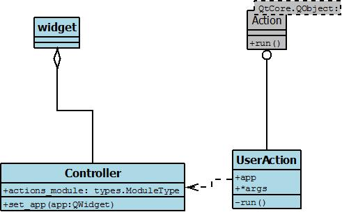

actions
=======

Раелизация ползовательских действий: ::

    создаём окно
    plot_widget = mainplot.PlotWidget()
    # создаём объект контроллера
    # plotactions - ссылка на модуль где определены пользовательские действия
    controllers = control.Controllers(plotactions)
    # передаём контроллер в окно
    plot_widget.controllers = controllers
    # создаём контролы
    plot_widget.init_tools()

зарегистрировать контрол: ::

   self.controllers.register(btn, "clicked", "Update", 5, 7)

зарегистрировать группу контролов: ::

   self.controllers.register_group(group_btn, "clicked", "Update", 5, 7)

class Controllers
-----------------

методы
~~~~~~

* __init__(self, app, actions_module):

   actions_module - ссылка на модуль где определены пользовательские действия

   app - ссылка на виджет в который устаналиваем контроллет

* set_app
* register
* register_group
* groups --> dict(name_group=group: QtWidgets.QButtonGroup)
* controls --> dict(name_control=control: QAbstractButton *)